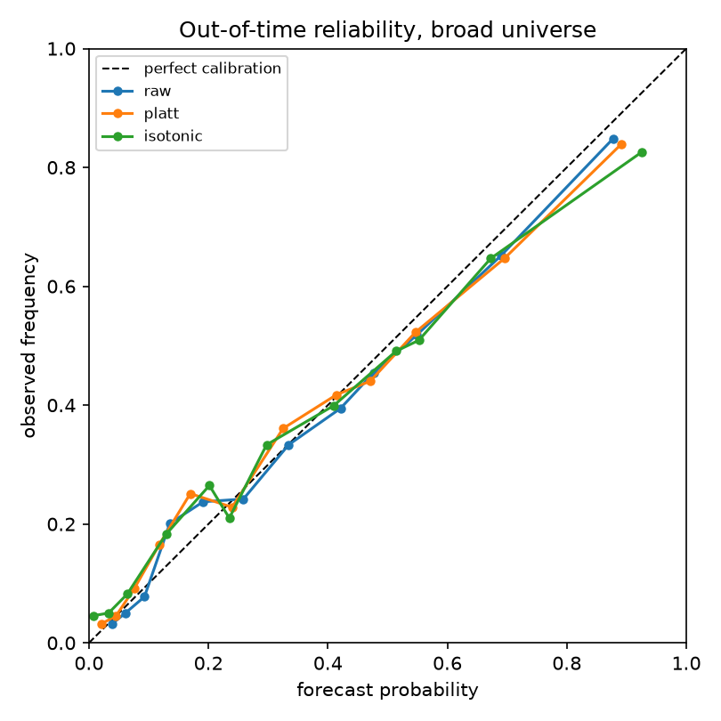
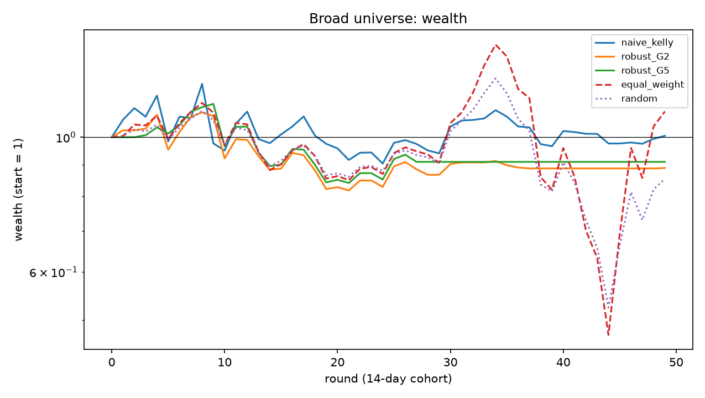
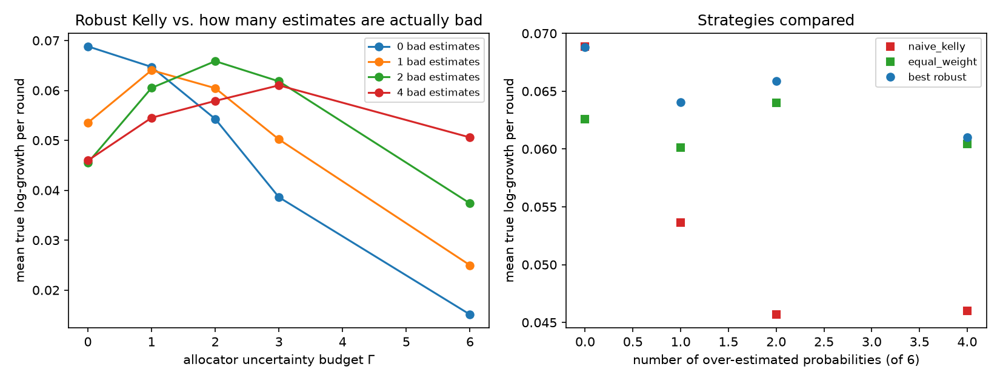

# Robust Kelly Allocation under Budgeted Uncertainty: Calibrated Probabilities from Prediction Markets

[](https://github.com/Hussmart/robust-kelly-prediction-markets/actions/workflows/ci.yml)

<!-- BEGIN:summary -->
> **Question.** Kelly sizing maximises expected log-growth but is fragile to errors in the estimated win probabilities. Can *robust optimisation* protect a prediction-market portfolio, and are market prices already calibrated probabilities?  
> **Method.** Bertsimas–Sim budgeted uncertainty on the probabilities (at most Γ of N estimates wrong at once); LP duality turns the max-min problem into a single-stage robust counterpart of expected log-growth, solved as a **MILP** (Pyomo + HiGHS) because the sensitivity is neither convex nor concave, and checked against an independent max-min solution. Probabilities come from Platt/isotonic calibration with Bayesian intervals, tested walk-forward on 2,623 out-of-time predictions and 524 bets.  
> **Answer.** On real data the answer is negative and reported as such: prices are already well calibrated (recalibration *raises* Brier score), the bets return +1.5% (90% CI -5.8% to +8.8%), so robust and naive Kelly are statistically indistinguishable. Where the truth is known (simulation), naive Kelly loses 34% of its growth when two of six estimates are wrong and robust Kelly with a matched Γ recovers 89% of the oracle's growth.
<!-- END:summary -->

A research pipeline that (1) pairs equivalent contracts on **Polymarket** and **Kalshi**, (2) looks for
cross-venue mispricings with an anomaly detector that must agree on *price and liquidity*,
(3) **recalibrates** market prices into probabilities with uncertainty, and (4) allocates capital with a
**Bertsimas–Sim robust Kelly** model written as a MILP (Pyomo + HiGHS). Everything is tested walk-forward on
resolved markets: 63 FOMC contract pairs on two venues and a broad universe of 2,720 markets.

The mathematics (equivalence, features, Roll spread, Isolation Forest, Platt/isotonic/Laplace intervals, the
LP-duality derivation of the robust counterpart, the backtest protocol) is in
**[docs/methodology.md](docs/methodology.md)**. Bugs and weaknesses found in review are in
**[docs/audit.md](docs/audit.md)**.

## Key findings

The main result is a well-tested **negative** one, together with a verified mechanism.

<!-- BEGIN:headline -->
* **The two venues agree.** On the 20 FOMC meetings the mean absolute cross-venue gap 24 h before the announcement is **0.65¢** (median 0.45¢); only **4 of 61** pairs differ by 2¢ or more.
* **A market price is already a good probability.** On 2,623 out-of-time predictions from a broad universe, recalibrating with Platt scaling or isotonic regression *increases* the Brier score (0.1656 raw, 0.1664 Platt, 0.1683 isotonic). The 90% event-bootstrap interval of the Platt gain is [-0.0015, -0.0001] (positive would mean it helps).
* **No exploitable edge.** The 524 bets the calibrated model chose over 49 fortnightly rounds returned **+1.5%** per bet, 90% interval [-5.8%, +8.8%], consistent with zero.
* **Robust Kelly does not beat naive Kelly on real data**, because there is no edge to protect. Of 32 robust-vs-naive sensitivity comparisons, 1 has a 90% interval excluding zero, about what chance alone produces. Robust Kelly with Γ = 3 does have a much smaller maximum drawdown than equal weight (-0.44, 90% interval [-0.56, -0.01]).
* **The mechanism is verified where the truth is known.** In the simulation, naive Kelly loses 34% of its growth once two of six probability estimates are wrong, and robust Kelly with a matched Γ recovers most of it.
<!-- END:headline -->

**Two look-ahead biases that would have produced a fake edge were found and removed** (details in
[docs/audit.md](docs/audit.md)). An exploratory first build of the broad universe selected markets by
*lifetime trading volume*, which is future information (a cheap market that goes on to resolve YES trades at
high prices and so accumulates more dollar volume). On that build the same pipeline reported **+22% return per
bet** (90% interval +7% to +38%) and a 9× final wealth for naive Kelly. Selecting the universe with information
available at the decision date only made the edge disappear. That exploratory build was not kept, but the two
tests that guard against the mistake (`test_cohorts_use_only_the_scheduled_end_date_not_the_actual_resolution`,
`test_entry_features_use_only_data_up_to_the_decision_date`) are in the suite.

## Motivation

Prediction markets price binary contracts that pay \$1 if an event happens. Three problems get in the way of
treating those prices as decision-grade probabilities:

1. **The same event can carry different prices on different venues.** Some gaps are real mispricings; others are
   artefacts of stale prices, thin books or wide spreads. Telling them apart is an **anomaly-detection** problem.
2. **Prices are not necessarily calibrated probabilities.** Favourite–longshot bias and liquidity effects mean
   0.80 need not mean 80%. Prices must be **recalibrated** against outcomes and the estimate's **uncertainty**
   quantified.
3. **Kelly sizing is fragile to estimation error.** Plugging noisy probabilities into Kelly over-bets.
   **Robust optimisation** with Bertsimas–Sim budgeted uncertainty (at most Γ of N estimates wrong at once)
   protects the allocation and makes conservativeness a tunable dial.

The project transfers the method of my undergraduate thesis (calibrating NLI confidence scores, then robust MILP
allocation under budgeted uncertainty) to a domain where outcomes are observable, so the value of calibration
and robustness can be measured, including when the answer is "no".

## Methodology at a glance

```
 Polymarket (Gamma, CLOB, data API)      Kalshi (REST v2, live + historical tiers)
              \                                   /
               +--> parquet cache --> hand-curated FOMC pair table (63 pairs, 20 meetings)
               |                                      |
               |                                      v
               |    features: implied prob, divergence, spread (quoted / Roll), volume,
               |              order-flow imbalance, volatility, staleness   (no look-ahead)
               |                                      |
               |          +---------------------------+------------------------+
               |          v                                                    v
               |   Isolation Forest score                        bipartite equivalence graph
               |          \                                     price signal AND liquidity signal
               |           +----------> flagged divergences <-----+
               |                                      |
               |                                      v
               |                      LazyPredict: is a gap real or noise?
               v
   broad universe: 69,729 resolved binary markets -> random sample -> 14-day cohorts
   (only ex-ante information: scheduled end date, open at decision date, pre-decision activity)
               |
               v
   calibration: Platt (Newton, Gaussian prior, Laplace interval) / isotonic (PAVA), expanding window
               |
               v
   allocation: naive Kelly | robust Kelly (MILP: LP duality + piecewise-linear incremental form) | equal weight
               |
               v
   walk-forward backtest settled with realised outcomes + paired bootstrap  ;  Monte Carlo with known truth
```

The robust model in one line: with win-probability estimates `p̂ᵢ`, downward errors `dᵢ` and budget Γ, maximise
`Σᵢ [B(fᵢ) + p̂ᵢ D(fᵢ)] − Γλ − Σᵢ νᵢ` subject to `λ + νᵢ ≥ dᵢ D(fᵢ)`, `Σ fᵢ ≤ F`, where `B(f)=log(1−f)` and
`D(f)=log(1+fb)−log(1−f)`. Because `D` is neither convex nor concave, it is linearised piecewise with ordering
binaries, hence a MILP ([derivation](docs/methodology.md#5-robust-kelly-allocation-srcoptimization)).

## Repository layout

```
src/collectors/    Polymarket + Kalshi clients, rate limiting, parquet cache, pair and universe collection
src/features/      feature engineering on paired series
src/anomaly/       Isolation Forest; bipartite graph + price-AND-liquidity consensus rule
src/calibration/   Platt (Newton + Laplace interval), isotonic (PAVA), metrics, cluster bootstrap
src/optimization/  naive Kelly (KKT root search), robust Kelly (Pyomo MILP)
src/backtest/      walk-forward engines (FOMC pairs, broad universe), metrics, paired bootstrap
src/baseline/      LazyPredict screen
scripts/           reproducible entry points (see below)
notebooks/         01_anomalies.ipynb, 02_results.ipynb (executed, read committed results only)
data/mappings/     the hand-curated pair table
data/sample/       FOMC feature panel, anomaly scores and the universe sample: every stage reruns offline
results/, figures/ every number and plot quoted here
tests/             offline test suite (+1 network smoke test)
docs/              methodology.md (the mathematics), audit.md (bugs found and fixed)
```

## Reproduce

```bash
python -m venv .venv
.venv/Scripts/pip install -r requirements.txt      # Windows; use .venv/bin/pip elsewhere
# requirements-lock.txt has the exact versions used for the reported numbers
```

Everything after the data download works offline from the committed `data/sample/` files:

```bash
.venv/Scripts/python scripts/run_anomaly_and_screen.py   # FOMC anomaly detection + LazyPredict screen
.venv/Scripts/python scripts/run_calibration.py          # FOMC calibration study
.venv/Scripts/python scripts/run_backtest.py             # FOMC walk-forward backtest
.venv/Scripts/python scripts/run_universe.py             # broad-universe calibration + backtest (~10 min)
.venv/Scripts/python scripts/run_simulation.py           # Monte Carlo study (~7 min)
.venv/Scripts/python scripts/make_readme_tables.py       # regenerate the result blocks of this README
.venv/Scripts/python -m pytest -m "not network"          # test suite
```

To rebuild the raw data from the public APIs (several hours because of rate limits; raw pulls are cached in
`data/raw/`):

```bash
.venv/Scripts/python scripts/build_fomc_mapping.py && .venv/Scripts/python scripts/collect_pairs.py
.venv/Scripts/python scripts/build_features.py
.venv/Scripts/python scripts/build_universe.py
```

## Results

All numbers in the tables are generated from `results/*.csv` by `scripts/make_readme_tables.py`, and a test fails
if this README drifts from the results.

### 1. Broad universe: 2,720 resolved markets, 57 fortnightly cohorts

**Design.** The population is all 69,729 resolved binary Polymarket markets scheduled to end between July 2024 and
August 2026, sampled uniformly at random (12,000). Decision dates are every 14 days; a market joins the cohort whose
decision date is 3–14 days before its *scheduled* end, if it is still open, has been active before that date
(≥ 10 hourly price changes in the previous 6 days, last change ≤ 24 h ago) and is not priced outside 3–97¢. At
each decision date the calibrator is fitted on earlier cohorts only. Bets are chosen by calibrated edge over a 1¢
cost (at most one per event, at most 12 per round), and settled with the realised outcome.

**Out-of-time calibration.**

<!-- BEGIN:universe_calibration -->
| method | Brier | ECE | log-loss | 90% CI of Brier gain over raw |
|---|---|---|---|---|
| raw | 0.1656 | 0.0259 | 0.4974 | - |
| platt | 0.1664 | 0.0245 | 0.5003 | [-0.0015, -0.0001] |
| isotonic | 0.1683 | 0.0401 | 0.5164 | [-0.0041, -0.0011] |
<!-- END:universe_calibration -->



**Allocation backtest** (primary configuration: budget 0.35 of wealth per round, cap 0.10 per bet, one bet per
event, 12 bets per round at most; 49 rounds after an 8-cohort burn-in):

<!-- BEGIN:universe_backtest -->
| strategy | cum. log-growth | final wealth | max drawdown | Sharpe-like | worst round |
|---|---|---|---|---|---|
| naive Kelly | 0.005 | 1.01 | 0.26 | 0.00 | -0.23 |
| robust Γ = 0 | -0.022 | 0.98 | 0.26 | -0.02 | -0.23 |
| robust Γ = 1 | -0.381 | 0.68 | 0.45 | -0.37 | -0.22 |
| robust Γ = 2 | -0.117 | 0.89 | 0.26 | -0.16 | -0.16 |
| robust Γ = 3 | -0.084 | 0.92 | 0.23 | -0.12 | -0.16 |
| robust Γ = 5 | -0.094 | 0.91 | 0.26 | -0.14 | -0.16 |
| robust Γ = 8 | -0.196 | 0.82 | 0.23 | -0.36 | -0.16 |
| equal weight | 0.097 | 1.10 | 0.67 | 0.05 | -0.30 |
| random subset | -0.158 | 0.85 | 0.58 | -0.11 | -0.23 |
<!-- END:universe_backtest -->



**Are the differences real?** Paired bootstrap over rounds (the same rounds are resampled for both strategies):

<!-- BEGIN:universe_inference -->
| comparison | observed | 90% paired-bootstrap CI | P(difference > 0) |
|---|---|---|---|
| `naive_kelly` − `equal_weight` | -0.092 | [-1.38, 1.15] | 0.46 |
| `naive_kelly` − `random` | 0.163 | [-0.76, 1.06] | 0.62 |
| `robust_G1` − `naive_kelly` | -0.386 | [-0.83, 0.03] | 0.06 |
| `robust_G2` − `naive_kelly` | -0.122 | [-0.67, 0.46] | 0.35 |
| `robust_G3` − `naive_kelly` | -0.089 | [-0.68, 0.55] | 0.40 |
| `robust_G5` − `naive_kelly` | -0.099 | [-0.73, 0.60] | 0.39 |
| `robust_G8` − `naive_kelly` | -0.201 | [-0.87, 0.53] | 0.31 |
| `robust_G1` − `equal_weight` | -0.478 | [-1.78, 0.81] | 0.28 |
| `robust_G2` − `equal_weight` | -0.214 | [-1.52, 1.05] | 0.40 |
| `robust_G3` − `equal_weight` | -0.182 | [-1.48, 1.10] | 0.41 |
| `robust_G5` − `equal_weight` | -0.191 | [-1.49, 1.09] | 0.41 |
| `robust_G8` − `equal_weight` | -0.293 | [-1.61, 1.01] | 0.36 |
<!-- END:universe_inference -->

**Sensitivity.** One setting changed at a time (all 16 variants are in `results/universe_sensitivity.csv`). The
interesting rows are the most efficient subsets, where naive Kelly bleeds and robust Kelly loses less:

<!-- BEGIN:universe_sensitivity -->
| variant | naive Kelly | robust Γ = 5 | equal weight | robust Γ = 5 − naive (90% CI) |
|---|---|---|---|---|
| `active_40changes` | -1.22 | -0.24 | -2.32 | +0.98 [0.01, 1.95] |
| `fresh_3h` | -0.58 | -0.14 | -0.85 | +0.44 [-0.31, 1.27] |
| `cost_3c` | -0.36 | -0.22 | -0.33 | +0.14 [-0.46, 0.80] |
| `cost_5c` | -0.33 | -0.00 | -0.30 | +0.32 [-0.22, 0.96] |
| `isotonic` | 0.40 | -0.03 | -0.19 | -0.44 [-2.15, 1.20] |
<!-- END:universe_sensitivity -->

How to read this: with no edge, sizing cannot create one. Naive Kelly's growth is near zero in the primary run and
strongly negative in the subsets where prices are most efficient, and robust Kelly with a large Γ loses less there
(`active_40changes`: the interval of the difference just excludes zero), which is the behaviour robustness is
designed for. With 16 variants and 2 Γ values per variant, one interval excluding zero is what chance produces, so
**this is not claimed as evidence** that robust Kelly helps.

### 2. Simulation with known ground truth: the price of robustness

Six independent bets per instance, exact expected log-growth (no outcome noise), 150 instances per column; `k` of
the 6 probability estimates are over-estimated by their full uncertainty radius, and the allocator does not know
which. Mean true growth per round, best non-oracle value in bold:

<!-- BEGIN:simulation -->
| strategy | k = 0 | k = 1 | k = 2 | k = 4 |
|---|---|---|---|---|
| oracle Kelly (true p; upper bound) | 0.0728 | 0.0708 | 0.0738 | 0.0700 |
| naive Kelly | **0.0689** | 0.0536 | 0.0457 | 0.0460 |
| robust Γ = 1 | 0.0647 | **0.0641** | 0.0605 | 0.0545 |
| robust Γ = 2 | 0.0543 | 0.0605 | **0.0659** | 0.0579 |
| robust Γ = 3 | 0.0386 | 0.0502 | 0.0618 | **0.0610** |
| robust Γ = 6 | 0.0151 | 0.0250 | 0.0374 | 0.0506 |
| equal weight | 0.0626 | 0.0601 | 0.0640 | 0.0605 |
<!-- END:simulation -->

Naive Kelly is best when the estimates are right and degrades quickly when some are wrong. Robust Kelly with Γ close
to the true number of bad estimates recovers most of the loss, a Γ that is too large costs growth, and **equal
weight is a strong baseline** that robust Kelly only beats when Γ is well matched.



### 3. FOMC cross-venue study (63 contract pairs, 20 meetings)

**Anomaly detection.**

<!-- BEGIN:fomc_findings -->
* Over 3,672 walk-forward-scored snapshots: 38 flagged by Isolation Forest, 389 by the price signal, 2,600 pass the liquidity signal, **303 by the joint consensus rule**.
* Persistence of ≥ 2¢ gaps 24 h later: liquid books 75% (n = 253) vs. illiquid 47% (n = 43), consistent with the rationale for the liquidity condition. But consensus-flagged gaps persist 61% (n = 18) vs. 71% (n = 278) for the rest: **the joint rule did not improve persistence in this sample**.
* LazyPredict screen (chronological test, 70 snapshots from 4 meetings, majority-class rate 69%): best balanced accuracy **0.68** (SGDClassifier), i.e. near chance. No model is worth tuning on this sample.
<!-- END:fomc_findings -->

**Calibration** (leave-one-meeting-out, pooled venue price, 24 h before the announcement):

<!-- BEGIN:fomc_calibration -->
| method | Brier | ECE | log-loss |
|---|---|---|---|
| raw price | 0.0091 | 0.0146 | 0.0456 |
| Platt, prior sd 1 | 0.0049 | 0.0003 | 0.0185 |
| Platt, weak prior | 0.0018 | 0.0003 | 0.0078 |
| isotonic | 0.0049 | 0.0047 | 0.0207 |
<!-- END:fomc_calibration -->

Raw prices are already very good (FOMC outcomes are nearly determined a day ahead). Only 16 of 246 snapshots (4
pairs) have a price between 0.15 and 0.85, so the calibration slope is barely identified: with a weak prior it
reaches 24.8 (near-perfect separation), with a unit-variance prior 2.4. That is why the Bayesian prior and Laplace
intervals were introduced (see [figures/calibration_bootstrap_band.png](figures/calibration_bootstrap_band.png)).

**Backtest** (14 rounds after a 6-meeting burn-in, 1–3 bets per round):

<!-- BEGIN:fomc_backtest -->
| strategy | cum. log-growth | final wealth | max drawdown |
|---|---|---|---|
| naive Kelly | 0.296 | 1.344 | 0.00 |
| robust Γ = 0 | 0.296 | 1.344 | 0.00 |
| robust Γ = 0.5 | 0.050 | 1.051 | 0.00 |
| robust Γ = 1 | 0.000 | 1.000 | 0.00 |
| robust Γ = 2 | 0.000 | 1.000 | 0.00 |
| robust Γ = 3 | 0.000 | 1.000 | 0.00 |
| robust Γ = 5 | 0.000 | 1.000 | 0.00 |
| equal weight | 0.293 | 1.340 | 0.00 |
| random subset | 0.190 | 1.209 | 0.00 |
<!-- END:fomc_backtest -->

Every bet was on a near-certain favourite (roughly 80–99¢) and every one won, so this return is **carry on
favourites, not evidence of an edge**, and no strategy ever lost a round (drawdown 0). Robust Kelly with Γ ≥ 1
places no bets there, because with uncertainty its worst-case probability falls below the price. That is coherent
("20 meetings cannot distinguish 0.996 from 0.8"), but it forgoes a gain that happened to materialise. With
cluster-bootstrap intervals, which collapse when no favourite ever lost, all robust strategies equal naive Kelly.
The Laplace intervals and pair weighting were introduced after that first run showed the collapse; the first
configuration is kept as a sensitivity (`results/backtest_sensitivity.csv`).

## Related Work / Inspiration

No code was copied from any of these; only the ideas.

* **[Jon-Becker/prediction-market-analysis](https://github.com/Jon-Becker/prediction-market-analysis)**: indexing
  Polymarket and Kalshi into parquet, which inspired the collectors and local cache.
* **[borisbanushev/anomaliesinoptions](https://github.com/borisbanushev/anomaliesinoptions)**: Isolation Forest on
  engineered mispricing features. Here the anomaly is a cross-*venue* divergence of identical events instead of an
  option-pricing anomaly, and a consensus rule requires price and liquidity signals to agree.
* **[shankarpandala/lazypredict](https://github.com/shankarpandala/lazypredict)**: used as a tool for the quick
  classifier screen.
* **[borisbanushev/stockpredictionai](https://github.com/borisbanushev/stockpredictionai)**: a popular LSTM/GAN
  price-prediction project that the ML community has criticised for look-ahead bias and overfitting. It is cited
  only to explain why this project deliberately avoids raw price forecasting and instead tests for look-ahead
  throughout (and, as the key findings show, found two look-ahead traps of its own).

Methodological references: Bertsimas & Sim (2004), *The Price of Robustness*; Kelly (1956); Platt (1999); Barlow
et al. (1972) (PAVA); Liu, Ting & Zhou (2008) (Isolation Forest); Roll (1984).

## Limitations

* **Small and noisy samples.** 49 backtest rounds in the broad study and 14 in the FOMC study. Intervals for
  differences between strategies are wide (about ±1 in cumulative log-growth), so only large effects could be
  detected. A null result here means "no effect large enough to see", not "no effect".
* **Polymarket price semantics.** The public price history does not document whether a point is a last trade or a
  midpoint, and there is no historical order book. A constant execution cost (1¢, with sensitivities up to 5¢)
  stands in for spread, fees and slippage, and no capacity limits are modelled.
* **Sampling.** The broad universe is a 12,000-market random sample of a 69,729-market population, filtered by
  ex-ante activity. 5.9% of the selected markets settle after the next decision date (a capital overlap the
  backtest ignores).
* **Manual event matching.** FOMC pairs were curated by hand and buckets matched by explicit rules; unions (e.g.
  "increase 25+") were excluded. The mapping covers FOMC only. It is **not** an automatic matcher, and elections and
  CPI are not covered.
* **Independence approximation.** The optimiser's separable log-growth treats the bets of a round as independent.
  The backtest settles with realised outcomes, and the universe study allows one bet per event, but bets across
  events can still be correlated.
* **Design decisions made after seeing results** are disclosed above and in the audit (Bayesian intervals, prior
  strength, the corrected universe selection). The number of comparisons is small but not zero, and multiple
  comparisons are counted where intervals are reported.
* Polymarket trades contain wallet addresses; they are dropped at ingestion and never stored.
