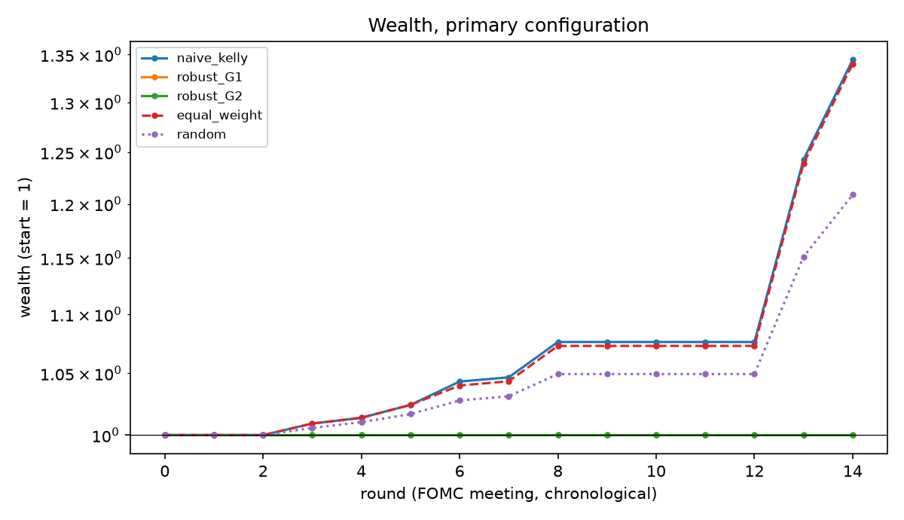

# Calibrated Mispricing Detection & Robust Capital Allocation for Prediction Markets

A research-style pipeline that (1) pairs equivalent contracts on **Polymarket** and **Kalshi**,
(2) looks for cross-venue mispricings with an anomaly detector that must agree on *price and
liquidity*, (3) **recalibrates** market prices into probabilities with uncertainty, and
(4) allocates capital with a **Bertsimas–Sim robust Kelly** model written as a MILP (Pyomo +
HiGHS), then tests all of it walk-forward on resolved FOMC-decision markets.

The mathematics (equivalence, features, Roll spread, Isolation Forest, Platt/isotonic/Laplace
intervals, the LP-duality derivation of the robust counterpart, the backtest protocol) is written
out in **[docs/methodology.md](docs/methodology.md)**.

> **Headline, honestly stated.** On 20 FOMC meetings the two venues agree to within about a cent
> (mean |gap| 0.8¢ at the decision time), so there is almost no cross-venue "arbitrage" to find
> once a 1¢ cost is paid. The bets the backtest does take are near-certain favourites, all of
> which won, so the real-data backtest cannot show whether robustness helps. What can be shown
> is the mechanism, with a known-ground-truth simulation: see [Results](#results) and
> [Limitations](#limitations).

## Motivation

Prediction markets price binary contracts that pay \$1 if an event happens. Three problems get in
the way of treating those prices as decision-grade probabilities:

1. **The same event can carry different prices on different venues.** Some gaps are real
   mispricings; others are artefacts of stale prices, thin books or wide spreads. Telling them
   apart is an **anomaly-detection** problem, and a price gap alone is not a reliable signal.
2. **Prices are not necessarily calibrated probabilities.** Favourite–longshot bias and liquidity
   effects mean 0.80 need not mean 80%. Prices must be **recalibrated** against outcomes, and the
   estimate's **uncertainty** quantified.
3. **Kelly sizing is fragile to estimation error.** Plugging noisy probabilities into Kelly
   over-bets. **Robust optimisation** with Bertsimas–Sim budgeted uncertainty (at most Γ of N
   estimates wrong at once) protects the allocation and makes conservativeness a tunable dial.

The project transfers the method of my undergraduate thesis (calibrating NLI confidence scores,
then robust MILP allocation under budgeted uncertainty) to a domain where outcomes are observable,
so the value of calibration and robustness can be measured.

## Methodology at a glance

```
 Polymarket (Gamma, CLOB, data API)      Kalshi (REST v2, live + historical tiers)
              \                                   /
               +--> parquet cache --> hand-curated pair table (63 pairs, 20 FOMC meetings)
                                          |
                                          v
        features: implied prob, divergence, spread (quoted / Roll), volume,
                  order-flow imbalance, volatility, staleness   (no look-ahead)
                                          |
              +---------------------------+-----------------------------+
              v                                                         v
  Isolation Forest score                              bipartite equivalence graph
              \                                       price signal AND liquidity signal
               +----------> flagged divergences <-----+          |
                                          |                        v
                                          |          LazyPredict: is a gap real or noise?
                                          v
        calibration: Platt (Newton, Gaussian prior, Laplace interval) / isotonic (PAVA)
        Brier, ECE, reliability diagram, cluster bootstrap over meetings
                                          |
                                          v
      allocation:  naive Kelly   |   robust Kelly (MILP: duality + piecewise-linear
                                 |   incremental formulation)   |   equal weight
                                          |
                                          v
        walk-forward backtest (settled with true mutually-exclusive payoffs)
        + Monte Carlo study with known ground truth (price of robustness)
```

The robust model in one line: with win-probability estimates `p̂ᵢ`, downward errors `dᵢ` and
budget Γ, maximise `Σᵢ [B(fᵢ) + p̂ᵢ D(fᵢ)] − Γλ − Σᵢ νᵢ` subject to `λ + νᵢ ≥ dᵢ D(fᵢ)`,
`Σ fᵢ ≤ F`, where `B(f)=log(1−f)` and `D(f)=log(1+fb)−log(1−f)`. Because `D` is neither convex nor
concave, it is linearised piecewise with ordering binaries, hence a MILP
([derivation](docs/methodology.md#5-robust-kelly-allocation-srcoptimization)).

## Repository layout

```
src/collectors/    Polymarket + Kalshi clients, rate limiting, parquet cache, pair collection
src/features/      feature engineering on paired series
src/anomaly/       Isolation Forest; bipartite graph + price-AND-liquidity consensus rule
src/calibration/   Platt (Newton + Laplace interval), isotonic (PAVA), metrics, cluster bootstrap
src/optimization/  naive Kelly (KKT root search), robust Kelly (Pyomo MILP)
src/backtest/      walk-forward engine and metrics
src/baseline/      LazyPredict screen
scripts/           reproducible entry points (see below)
notebooks/         01_anomalies.ipynb, 02_results.ipynb (executed, read committed results only)
data/mappings/     the hand-curated pair table
data/sample/       feature panel (4,324 snapshots) and anomaly scores, enough to rerun every stage
results/, figures/ every number and plot quoted here
tests/             86 offline tests (+1 network smoke test)
docs/              methodology.md
```

## Reproduce

```bash
python -m venv .venv
.venv/Scripts/pip install -r requirements.txt      # Windows; use .venv/bin/pip elsewhere
```

Everything after the data download works offline from the committed `data/sample/` files:

```bash
.venv/Scripts/python scripts/run_anomaly_and_screen.py   # stages 4 and 6
.venv/Scripts/python scripts/run_calibration.py          # stage 5
.venv/Scripts/python scripts/run_simulation.py           # ~7 min, Monte Carlo
.venv/Scripts/python scripts/run_backtest.py             # stage 8
.venv/Scripts/python -m pytest -m "not network"          # 86 tests
```

To rebuild the raw data from the public APIs (about 1 hour, raw pulls are cached in `data/raw/`):

```bash
.venv/Scripts/python scripts/build_fomc_mapping.py
.venv/Scripts/python scripts/collect_pairs.py
.venv/Scripts/python scripts/build_features.py
```

## Results

All numbers below are produced by the code in this repository (`results/*.csv`). 20 FOMC
meetings between May 2024 and Sep 2026, 63 equivalent contract pairs, 4,324 six-hourly snapshots.

### Cross-venue divergences and anomaly detection

* At the decision time (24 h before the announcement) the mean absolute gap is **0.8¢**, and only
  **3 of 61** pairs differ by ≥ 2¢.
* Over 3,672 walk-forward-scored snapshots: 39 flagged by Isolation Forest, 194 by the price
  signal, 2,640 pass the liquidity signal, **175 by the joint consensus rule**.
* Persistence of ≥ 2¢ gaps 24 h later: liquid books 75% (n = 256) vs. illiquid 46% (n = 41),
  consistent with the rationale for the liquidity condition. But consensus-flagged gaps persist
  68% (n = 19) vs. 72% (n = 278) for the rest: **the joint rule did not improve persistence in this
  sample**, and n is far too small to claim otherwise.
* LazyPredict screen (chronological test meetings, ~70 snapshots): best balanced accuracy **0.62**
  (QDA), i.e. near chance; no model is worth tuning on this sample.

### Calibration (leave-one-meeting-out, pooled venue price, near the decision time)

| method | Brier | ECE | log-loss |
|---|---|---|---|
| raw price | 0.0091 | 0.0159 | 0.0469 |
| Platt, prior sd 1 (used downstream) | 0.0049 | 0.0003 | 0.0185 |
| Platt, weak prior | 0.0018 | 0.0003 | 0.0078 |
| isotonic | 0.0049 | 0.0047 | 0.0207 |

Raw prices are already very good (FOMC outcomes are nearly determined a day ahead). Recalibration
mostly says "favourites are under-priced". Only 16 of 246 snapshots (4 pairs) have a price
between 0.15 and 0.85, so the slope is barely identified: with a weak prior it reaches a = 24.8
(near-perfect separation), with a unit-variance prior a = 2.4. This is why the Bayesian prior and
Laplace intervals were introduced (see [figures/calibration_bootstrap_band.png](figures/calibration_bootstrap_band.png)).

### Robust Kelly: simulation with known ground truth

Six independent bets per instance, exact expected log-growth, 150 instances per column; `k` of
the 6 probability estimates are over-estimated by their full radius. Mean true growth per round:

| strategy | k = 0 | k = 1 | k = 2 | k = 4 |
|---|---|---|---|---|
| oracle Kelly (true p, upper bound) | 0.0728 | 0.0708 | 0.0738 | 0.0700 |
| naive Kelly | **0.0689** | 0.0536 | 0.0457 | 0.0460 |
| robust Γ = 1 | 0.0647 | **0.0641** | 0.0605 | 0.0545 |
| robust Γ = 2 | 0.0543 | 0.0605 | **0.0659** | 0.0579 |
| robust Γ = 3 | 0.0386 | 0.0502 | 0.0618 | **0.0610** |
| robust Γ = 6 (= worst case) | 0.0151 | 0.0250 | 0.0374 | 0.0506 |
| equal weight | 0.0626 | 0.0601 | 0.0640 | 0.0605 |

Naive Kelly is best when estimates are right and loses about a third of its growth once a few are
wrong. Robust Kelly with Γ close to the true number of bad estimates recovers most of the loss
(and beats equal weight by up to ~0.004), and a Γ that is too large costs growth. **Equal weight is
a strong baseline**: robust Kelly only beats it when Γ is well matched.


### Backtest on real FOMC markets (14 rounds after a 6-meeting burn-in)

Primary configuration: decide 24 h before the announcement, Platt with Laplace intervals, 1¢
cost, budget 0.6 of wealth, 0.3 per bet. Rounds settle with the true mutually-exclusive payoffs.

| strategy | cum. log-growth | final wealth | max drawdown | Sharpe-like |
|---|---|---|---|---|
| naive Kelly (= robust Γ = 0) | 0.296 | 1.344 | 0 | 1.45 |
| robust Γ = 0.5 | 0.058 | 1.059 | 0 | 1.07 |
| robust Γ ≥ 1 | 0.000 | 1.000 | 0 | n/a |
| equal weight | 0.293 | 1.340 | 0 | 1.44 |
| random subset | 0.190 | 1.209 | 0 | 1.46 |

* Every bet placed was on a favourite priced roughly 80–99¢ and **every one won**, so no strategy ever lost; the
  drawdowns are zero and the Sharpe-like values are not meaningful.
* With Bayesian intervals **robust Kelly with Γ ≥ 1 does worse than naive Kelly: it places no bets**
  (the worst-case probability drops below the ~0.98 price). That is a coherent answer to "20
  meetings cannot distinguish 0.996 from 0.8", but here it forgoes a gain that materialised. With
  cluster-bootstrap intervals (which collapse to ±0.2¢ when no favourite ever lost) all robust
  strategies equal naive Kelly. Conclusions therefore depend entirely on how the uncertainty set is
  built. See `results/backtest_sensitivity.csv` for cost, horizon, budget, isotonic and consensus
  variants (the consensus filter selects no bets at all).
* **Disclosure:** the Laplace intervals and pair weighting were introduced after a first run showed
  the bootstrap collapse; that first configuration is reported as a sensitivity.
* Bets per round: mean 1.07, max 3. The optimiser cannot be meaningfully tested on N ≈ 1.



## Related Work / Inspiration

No code was copied from any of these; only the ideas.

* **[Jon-Becker/prediction-market-analysis](https://github.com/Jon-Becker/prediction-market-analysis)**:
  indexing Polymarket and Kalshi into parquet, which inspired the collectors and local cache.
* **[borisbanushev/anomaliesinoptions](https://github.com/borisbanushev/anomaliesinoptions)**:
  Isolation Forest on engineered mispricing features. Here the anomaly is a cross-*venue*
  divergence of identical events instead of an option-pricing anomaly, and a consensus rule requires
  price and liquidity signals to agree.
* **[shankarpandala/lazypredict](https://github.com/shankarpandala/lazypredict)**: used as a tool
  for the quick classifier screen.
* **[borisbanushev/stockpredictionai](https://github.com/borisbanushev/stockpredictionai)**: a
  popular LSTM/GAN price-prediction project that the ML community has criticised for look-ahead
  bias and overfitting. It is cited only to explain why this project deliberately avoids raw price
  forecasting and instead tests for look-ahead throughout (`test_no_lookahead`,
  `test_future_outcomes_do_not_change_past_decisions`).

Methodological references: Bertsimas & Sim (2004), *The Price of Robustness*; Kelly (1956);
Platt (1999); Barlow et al. (1972) (PAVA); Liu, Ting & Zhou (2008) (Isolation Forest); Roll (1984).

## Limitations

* **Tiny sample.** 20 resolved meetings, 14 backtest rounds, and an average of one bet per round.
  Backtest numbers are indicative, not evidence of a tradable edge or of robust Kelly's value.
* **Manual event matching.** Meeting pairs were curated by hand and buckets matched by explicit
  rules; unions (e.g. "increase 25+") were excluded. The mapping is FOMC only and is **not** an
  automatic matcher. Elections and CPI were not covered.
* **Thin, near-deterministic markets.** FOMC outcomes are almost known a day ahead, so favourites
  dominate and calibration is identified by a handful of mid-range prices.
* **Independence approximation.** The optimiser's separable log-growth treats bets as independent,
  whereas buckets of one meeting are mutually exclusive. Settlement uses true payoffs, but the
  allocation is not exactly optimal for that joint distribution.
* **Execution.** Costs are a constant 1¢ added to the price. Polymarket's public API has no
  historical order book, so spread there is a Roll estimate and the price series is used as is;
  no fees, slippage or capacity limits are modelled.
* **Design decisions made after seeing results** are disclosed above (Bayesian intervals, prior
  strength). The number of comparisons is small but not zero.
* Polymarket trades contain wallet addresses; they are dropped at ingestion and never stored.
